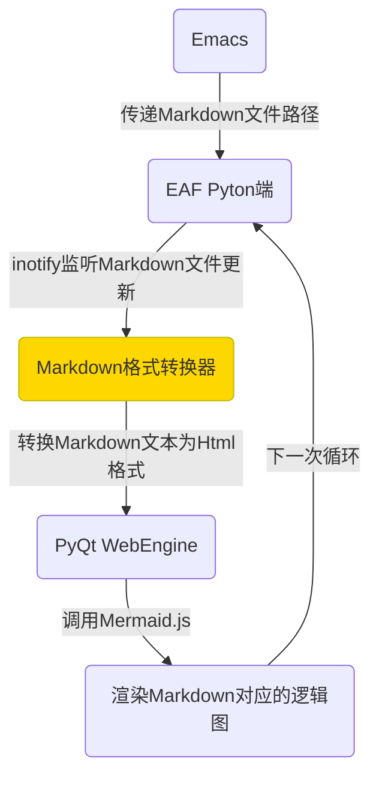

### 发现新大陆
在Emacs-China论坛闲逛时发现了 mermaid.js 这个图形库，这个图形库的最大优势是，你可以直接编写 markdown 文本，他会自动生成流程图、饼状图、干特图、类型图、序列图等逻辑图形。

今天花了1个多小时写了个新的[补丁](https://github.com/manateelazycat/emacs-application-framework/commit/ca52b4b383385a89ea070f1729899404d4a10003)把Mermaid.js集成到EAF框架中。

通过这个补丁，Emacs可以直接编辑Markdown文档，EAF做实时同步渲染，特别是制作技术文章配图的时候，直接修改文本的效率是鼠标拖拽图形的10倍以上，再也不会遇到以前复杂图形改动时越理越乱的问题了。

### 安装使用
1. 更新到最新版EAF
2. 通过pip3或者pacman安装pyinotify、markdown这两个Python库
3. 新建扩展名为 mmd 的文件

然后参照 [Mermaid文档](https://mermaidjs.github.io/#/) 来创建你自己的逻辑图吧！

EAF会自动处理刷新的问题，当你在左边修改逻辑图文本内容时，EAF会自动在右边刷新文本对应的逻辑图。

### 实验
只需要短短的几行文本就可以自动生成EAF Mermaid插件的流程图：

<pre>

</pre>

通过这种方式，我们只需要关心逻辑图的内容和相互关系就可以了，不用关心逻辑图的布局问题，mermaid.js会自动搞定，节省了大量鼠标拖拽图形的时间。

现在EAF可以直接制作思维导图和流程图，真的太方便了，哈哈哈哈。
